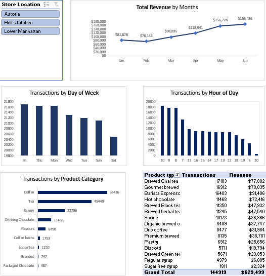

### Coffee Shop Sales Dashboard — Microsoft Excel

An interactive Excel dashboard analyzing coffee shop sales data to identify trends and understand product performance.

**Key areas:**

* Sales performance
* Product and category analysis
* Time-based sales trends
* KPI reporting
* Data visualization
* Business insights

**Tools:** Microsoft Excel, PivotTables, Excel formulas, Charts

